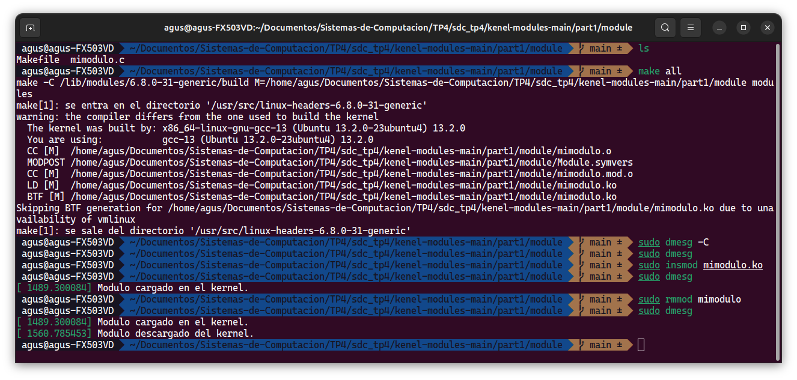
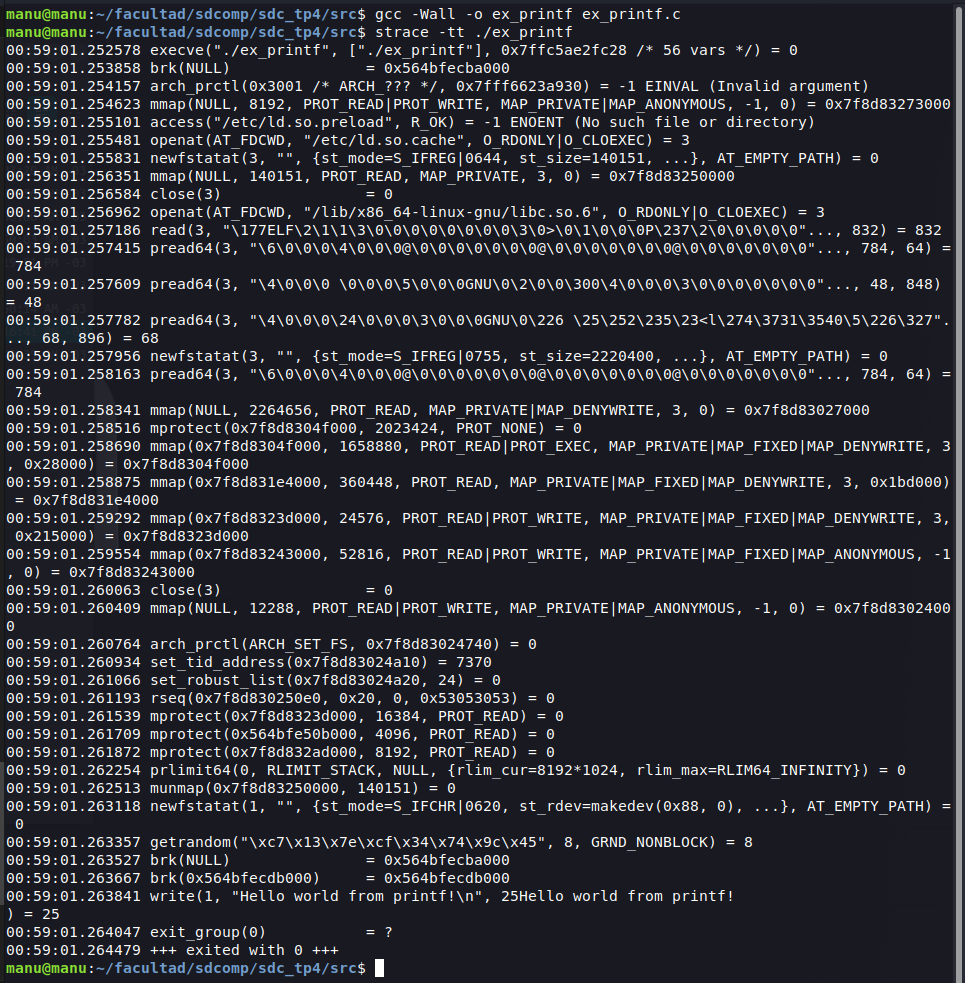
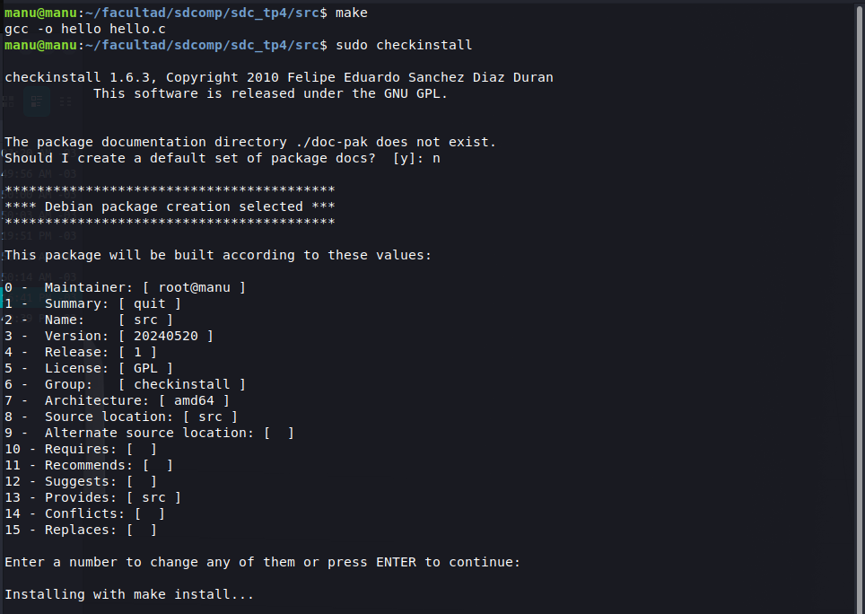
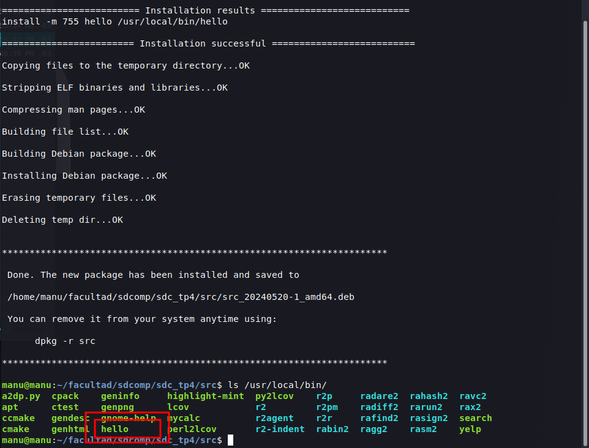
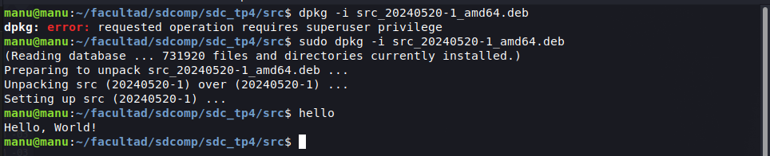
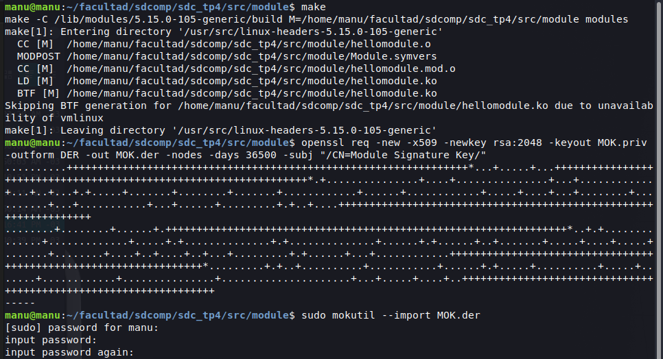
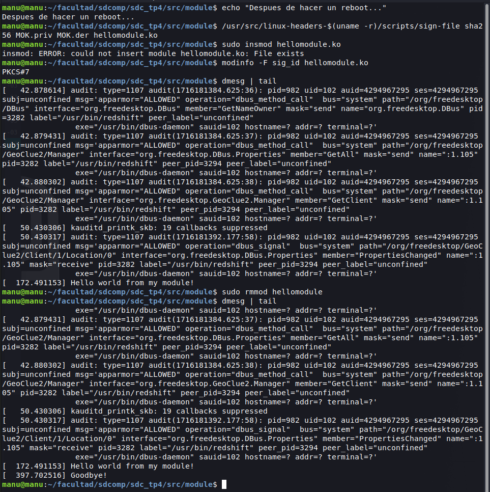
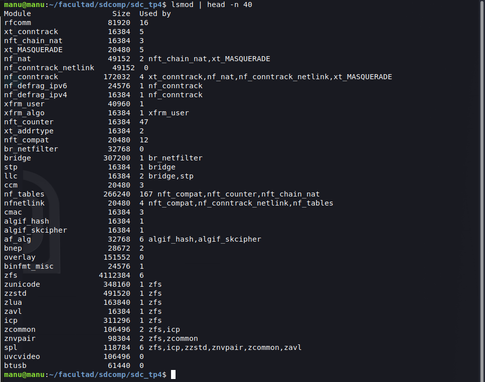
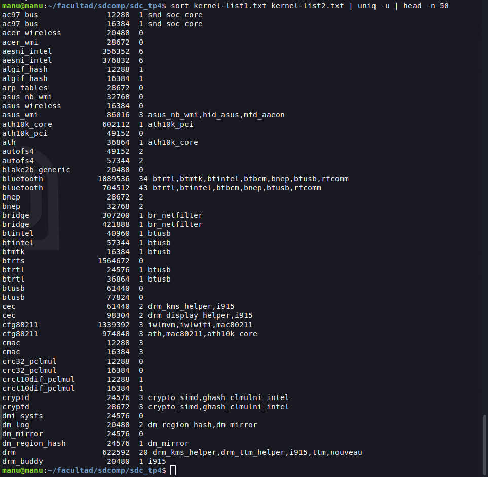

# Sistemas de Computacion
Trabajo Practico 4 - Sistemas de Computacion 

## Kernel-modules

**Integrantes:**
- [Gil Cernich, Manuel](https://github.com/manugcr/)
- [Pallardo, Agustin](https://github.com/djpallax)
- [Saporito, Franco](https://github.com/fasaporito)

---

## Objetivo
En este trabajo practico se busca realizar una serie de preguntas relacionadas con el kernel de linux. Se busca entender el funcionamiento de los modulos del kernel, como se pueden compilar y cargar en el sistema operativo.

**¿Qué es exactamente un módulo del kernel?**
Los módulos son fragmentos de código que se pueden cargar y descargar en el kernel según se requiera. Extienden la funcionalidad del kernel sin necesidad de reiniciar el sistema. Por ejemplo, un tipo de módulo es el controlador de dispositivo, que permite que el núcleo acceda al hardware conectado al sistema. Sin módulos, tendríamos que construir kernels monolíticos y agregar nuevas funciones directamente en la imagen del kernel. Además de tener kernels más grandes, esto tiene la desventaja de requerir que reconstruyamos y reiniciemos el kernel cada vez que queramos una nueva funcionalidad.

---

## Preparacion
Como base se necesita tener instalado linux, por otro lado vamos a utilizar un repositorio creado por la catedra de la materia el cual vamos a encontrar en el siguiente link [Repositorio](https://gitlab.com/sistemas-de-computacion-unc/kenel-modules) y vamos a clonar el repositorio en nuestra maquina local.

Tambien es importante considerar tener todas las dependencias necesarias:

```bash
sudo apt-get install build-essential checkinstall linux-source
```

En caso de que falle (por ejemplo, en ubuntu 24.04 tira error), probar lo siguiente:

```bash
sudo apt install build-essential 
sudo apt install checkinstall 
sudo apt install linux-source
```

Se descargo el codigo fuente del kernel de linux, en este caso, la versión `6.8.0`, donde el archivo comprimido se llama `linux-source-6.8.0.tar.bz2`, ahora debemos extraerla:

```bash
cd /usr/src
ls # Para visualizar qué versión se ha descargado
sudo tar -xvf linux-source-6.8.0.tar.bz2
```

Luego, desde la raiz del proyecto:

```bash
cd kenel-modules-main/part1/module/
```

En el código `mimodulo.c` hay una advertencia que se puede solucionar fácilmente agregando las siguientes línes antes de las funciones:

```c
int modulo_lin_init(void);
void modulo_lin_clean(void);
```

**IMPORTANTE**: Antes de ejecutar el make, verificar que la ruta no contenga carácteres especiales, como por ejemplo, espacio " "

```bash
make
sudo dmesg -C
sudo insmod mimodulo.ko
sudo dmesg
sudo rmmod mimodulo
sudo dmesg
```

Con esto, compilamos el módulo, limpiamos el historial en dmesg, instalamos el módulo, vemos los mensajes con dmesg y se comprueba la carga. Luego, removemos el módulo y verificamos. En caso de que hayan problemas en la carga, verificar que se compile para el kernel que se está utilizando, y si no se resuelve, eliminar los kernels y headers anteriores (que no sea el actual).

Con `modinfo mimodulo.ko` podemos ver detalles sobre el módulo compilado.

<p align="center">
  <br>
  <em>Fig 1. Carga y descarga del módulo.</em>
</p>

---

## Seguridad del kernel.
Para mejorar la seguridad del kernel en Linux, una medida crucial es evitar la carga de modulos que no esten firmados, especialmente cuando se usa Secure Boot. Este mecanismo asegura que solo se carguen módulos firmados en el kernel, evitando la carga de módulos maliciosos. Ademas de esta firma de modulos existen otras medidas importantes.

### Firma de módulos
Firmar módulos del kernel es una forma de mantener la seguridad del sistema. Esta práctica ayuda a asegurar que solo el software verificado se ejecuta en el kernel.

### SELinux o AppArmor
Estas son soluciones de seguridad que proporcionan políticas de control de acceso obligatorias, restringiendo las capacidades de los procesos y usuarios para interactuar con el sistema.

### Blacklisting de módulos
Configurar listas negras para evitar que se carguen módulos potencialmente inseguros y listas blancas para asegurarse de que solo se carguen módulos específicos y verificados.

### Configuraciones de seguridad del kernel
Ajustar parámetros de seguridad en el archivo `/etc/sysctl.conf` para deshabilitar funcionalidades innecesarias y reducir la superficie de ataque. Esto incluye deshabilitar core dumps, habilitar la aleatorización del espacio de direcciones (ASLR), y restringir el acceso a la memoria compartida.

### Control de acceso al hardware
Limitar el acceso a dispositivos de hardware críticos mediante configuraciones adecuadas en `/etc/modprobe.d/ `y asegurando que solo los usuarios autorizados puedan cargar módulos del kernel.

---

## Modulos vs Programas

### Cómo empiezan y terminan los módulos y programas?
A diferencia de un programa convencional, en el que programa principal comienza en un main y termina devolviendo un número para notificar si finalizó correctamente o con errores, en un módulo se definen dos funciones, una para el inicio y la otra para el fin. Se puede ver en el código de ejemplo, que hay una línea que dice `module_init(modulo_lin_init);` que indica que el módulo comienza en la función modulo_lin_init (esto sería como un setup del módulo), y otra función, `module_exit(modulo_lin_clean);`, que define que `modulo_lin_clean` se utilizará para cuando se quiera descargar o remover el módulo del kernel.

### Que funciones tiene disponible un programa y un módulo?
Los programas tienen acceso a todas las funciones de la librería estándar de C, que son de alto nivel como `printf()`, y a las funciones que se definan en el código. Los módulos, por otro lado, tienen acceso a funciones específicas del kernel (system calls), como `module_init` y `module_exit`, que se utilizan para definir el inicio y el fin del módulo, respectivamente.

Con el comando `strace` se puede ver las llamadas al sistema que realiza un programa, y con `lsmod` se pueden ver los módulos cargados en el kernel. En el directorio `proc/kallsyms` se pueden ver las funciones del kernel.

En el siguiente ejemplo veremos la compilacion y analizaremos el codigo de ejemplor `ex_printf.c`

```c
#include <stdio.h>

int main() 
{
    printf("Hello world from printf!\n");
    return 0;
}
```

Compilando el codigo con `gcc -Wall -o ex_printf ex_printf.c` y ejecutando strace `strace -tt ./ex_printf` observamos la siguiente salida que muestra todas las syscalls que realiza el programa.

<p align="center">
  <br>
  <em>Fig 2. Strace printf.</em>
</p>

Tambien podemos ver la lista ordenada por syscall y el tiempo de ejecucion utilizado.

```bash
manu@manu:~/facultad/sdcomp/sdc_tp4/src$ strace -c ./ex_printf 
Hello world from printf!
% time     seconds  usecs/call     calls    errors syscall
------ ----------- ----------- --------- --------- ----------------
  0,00    0,000000           0         1           read
  0,00    0,000000           0         1           write
  0,00    0,000000           0         2           close
  0,00    0,000000           0         8           mmap
  0,00    0,000000           0         4           mprotect
  0,00    0,000000           0         1           munmap
  0,00    0,000000           0         3           brk
  0,00    0,000000           0         4           pread64
  0,00    0,000000           0         1         1 access
  0,00    0,000000           0         1           execve
  0,00    0,000000           0         2         1 arch_prctl
  0,00    0,000000           0         1           set_tid_address
  0,00    0,000000           0         2           openat
  0,00    0,000000           0         3           newfstatat
  0,00    0,000000           0         1           set_robust_list
  0,00    0,000000           0         1           prlimit64
  0,00    0,000000           0         1           getrandom
  0,00    0,000000           0         1           rseq
------ ----------- ----------- --------- --------- ----------------
100,00    0,000000           0        38         2 total
```

### Espacio de usuario vs espacio del kernel
El espacio de usuario es el entorno en el cual se ejecutan las aplicaciones de los usuarios. Tiene acceso limitado a los recursos del sistema y no puede interactuar directamente con el hardware. Las aplicaciones en este espacio solicitan servicios al sistema operativo mediante llamadas al sistema (system calls), que son gestionadas por el kernel. Esto protege al sistema de errores y de acciones malintencionadas, ya que cualquier operación crítica debe ser validada por el kernel.

El espacio de kernel es el entorno donde se ejecuta el kernel del sistema operativo y tiene acceso completo al hardware y a la memoria del sistema. El kernel gestiona las operaciones de bajo nivel como la comunicación con el hardware, la gestión de la memoria, la planificación de tareas y la seguridad del sistema. Dado que el código en el espacio del kernel se ejecuta con privilegios elevados, cualquier error o vulnerabilidad aquí puede comprometer todo el sistema.

El kernel actúa como un intermediario, asegurando que las aplicaciones de usuario no puedan interferir directamente con las operaciones críticas del sistema.

### Espacio de datos y espacio de código para usuario y kernel.
El espacio de memoria se puede dividir en espacio de datos y espacio de código, tanto para el usuario como para el kernel.

#### Espacio de código
En el espacio de **usuario** se encuentra el código ejecutable de las aplicaciones. Cada aplicación tiene su propio espacio de código, aislado del código de otras aplicaciones y del kernel. Esto previene que una aplicación afecte directamente a otras o al sistema operativo.

El espacio de **kernel** contiene el código ejecutable del núcleo del sistema operativo. Este espacio es compartido y accesible solo por el kernel y no por las aplicaciones de usuario.

#### Espacio de datos
El espacio de **usuario** incluye las variables y estructuras de datos que las aplicaciones necesitan durante su ejecución. Al igual que el espacio de código, este espacio es específico para cada aplicación y está aislado del resto del sistema.
En el espacio de **kernel** se almacenan las estructuras de datos utilizadas por el kernel para gestionar el sistema. Esto incluye tablas de procesos, buffers de entrada/salida, tablas de archivos, y otros datos necesarios para el funcionamiento del sistema operativo.

### Drivers. Que hay en /dev/?
Los **drivers** son son componentes del kernel que permiten al sistema operativo comunicarse con el hardware. Cada archivo en `/dev/` tiene asociado un controlador en el kernel que maneja las operaciones de lectura y escritura para ese dispositivo. Los controladores traducen las solicitudes del sistema operativo en comandos que el hardware puede entender.

El directorio `/dev/` en sistemas Unix y Linux contiene archivos especiales conocidos como device files. Estos archivos actúan como interfaces para interactuar con los controladores de hardware (drivers) del sistema.

Podemos tener dos tipos de archivos en `/dev/`:
- **Character devices**: Representan dispositivos que manejan datos carácter por carácter, como terminales, puertos serie, y algunos dispositivos de entrada/salida. Ejemplos incluyen `/dev/tty` (terminal) y `/dev/ttyS0` (primer puerto serie).
- **Block devices**: Representan dispositivos que manejan datos en bloques, como discos duros y unidades de almacenamiento. Ejemplos incluyen`/dev/sda` (primer disco duro) y sus particiones como `/dev/sda1`.

---

## Que es Checkinstall?
Checkinstall es una herramienta utilizada en sistemas Linux para facilitar la instalación de software compilado desde el código fuente. Cuando compilas software desde el código fuente, el proceso tradicional implica usar herramientas como `make` y `make install`, que copian directamente los binarios compilados y otros archivos necesarios a los directorios apropiados en tu sistema. Sin embargo, este enfoque tiene algunas desventajas, como la dificultad para rastrear qué archivos se instalaron y los desafíos para eliminar el software de manera limpia.

Checkinstall es una utilidad que envuelve el comando `make install`. En lugar de instalar directamente el software compilado en el sistema, rastrea todos los archivos que se instalarían y crea un paquete para el gestor de paquetes de tu sistema como por ejemplo `deb.`. Este paquete luego puede ser instalado, actualizado o eliminado usando las herramientas estándar de gestión de paquetes como `apt`.

### Quien carga los modulos de kernel?
Los módulos del kernel se cargan en el sistema operativo por el administrador del sistema o por el sistema operativo mismo. Los administradores pueden cargar módulos manualmente utilizando comandos como `insmod` o `modprobe`, o automáticamente mediante scripts de inicio o configuraciones específicas.

### Ejemplo checkinstall
En el siguiente ejemplo se muestra como se puede instalar un programa con checkinstall, en este caso se empaquetara el ejemplo `hello_world.c`, para ello necesitamos crear un makefile para luego poder instalarlo con checkinstall. Siguiendo los siguientes comandos instalaremos el modulo y este se vera reflejado en /usr/local/bin/hello.

```bash
$ make
$ sudo checkinstall
$ ls /usr/local/bin/
```

<p align="center">
  <br>
  <em>Fig 3. Checkinstall setup.</em>
</p>

<p align="center">
  <br>
  <em>Fig 4. Checkinstall paso final.</em>
</p>

<p align="center">
  <br>
  <em>Fig 5. Ejecucion del paquete.</em>
</p>

---

## Firma de modulos de kernel
La firma de módulos del kernel es un mecanismo de seguridad que garantiza que los módulos cargados en el kernel estén firmados digitalmente y sean confiables. Este proceso ayuda a prevenir la carga de módulos maliciosos o no autorizados en el sistema.

En el siguiente ejemplo firmaremos el modulo `hellomodule.ko` y luego lo cargaremos en el kernel.

```bash
$ make
$ openssl req -new -x509 -newkey rsa:2048 -keyout MOK.priv -outform DER -out MOK.der -nodes -days 36500 -subj "/CN=Module Signature Key/"
$ sudo mokutil --import MOK.der
$ sudo reboot

# Rebooting...

$ /usr/src/linux-headers-$(uname -r)/scripts/sign-file sha256 MOK.priv MOK.der hellomodule.ko
$ sudo insmod hellomodule.ko
$ modinfo -F sig_id hellomodule.ko
$ dmesg | tail
```

Para firmar un módulo, primero se debe generar un par de claves pública y privada, luego se importa la clave pública al sistema y se reinicia. Luego, se firma el módulo con la clave privada y se carga en el kernel. Finalmente, se verifica la firma del módulo y se revisan los mensajes del kernel.

El comando `openssl` se utiliza para generar el par de claves, `mokutil` se utiliza para importar la clave pública al sistema, `sign-file` se utiliza para firmar el módulo.

En la siguiente imagen podemos ver el proceso de firma y carga del modulo en el kernel.

<p align="center">
  <br>
  <em>Fig 5. Signature setup.</em>
</p>

<p align="center">
  <br>
  <em>Fig 6. Signature final.</em>
</p>

Si alguien con secure boot habilitado quisise cargar un modulo firmado por mi, el firmware del sistema UEFI verificaria la firma digital antes de que se cargue al sistema, si esta firma no es una clave reconocida lo mas probable es que el sistema rechace la carga del modulo.

---

## Que diferencias se pueden obersevar entre estos dos modinfo?
(...)

## Que drivers estan cargados en mi sistema?
Con el comando `lsmod` es posible ver todos los modulos cargados en el sistema, en la siguiente imagen se puede ver un ejemplo de la salida de este comando con los primeros 40 modulos. Donde la tercer columna `Used` indica la cantidad de veces que el modulo ha sido referenciado.

<p align="center">
  <br>
  <em>Fig 7. Modulos de kernel listados.</em>
</p>

Si comparamos con otra salida de `lsmod` desde otra computadora podemos utilizar el comando `diff` para ver las diferencias entre los modulos cargados, o tambien podemos utilizar `sort` en conjunto con `uniq` para ver solo las lineas unicas.

<p align="center">
  <br>
  <em>Fig 8. Modulos de kernel diferentes.</em>
</p>

---

## Bibliografia

- [RedHat - Kernel](https://access.redhat.com/documentation/es-es/red_hat_enterprise_linux/8/html/managing_monitoring_and_updating_the_kernel/signing-kernel-modules-for-secure-boot_managing-kernel-modules) 
- [strace](https://opensource.com/article/19/10/strace )
- [The Linux Kernel Module Programming Guide](https://sysprog21.github.io/lkmpg/)
- [How Do Linux Kernel Drivers Work? - LiveOverflow](https://youtu.be/juGNPLdjLH4?si=7maCYKVwH-heiSxr)
- [Kernel Development - LowLevelLearning](https://youtu.be/lWzFFusYg6g?si=9mKaBESCFMW3ldai)

